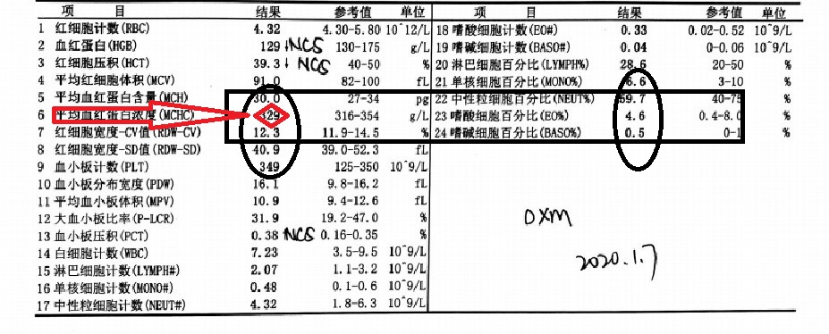
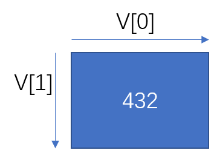
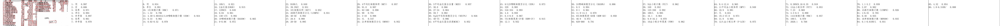
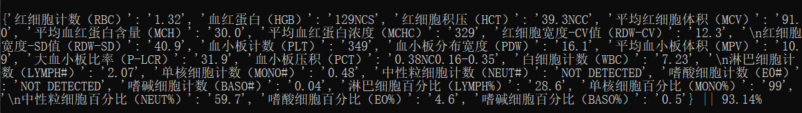

# Simple Algorithm to Get Correct Key-Value in paddleOCR Test Sheet Recognition

## Backgrounds
paddleOCR returns shuffled outputs after recognizing images.
For us to output correct key-value in medical test sheets, I design simple algorithm derived from paddleOCR outputs reasonably.

## Hows and Whys

We can see in the figure, to detect from '结果', we have to find coordinates related to '结果' and key.
As an example, let's use 平均血红蛋白浓度（MCHC） item, to detect 329 correctly. 
First, we have to understand that if we find one item has coordinates \v\, that it will be geometrically illustrated like this


Then, we will filter results. We filter both coulmns that contain '结果' via choosing the closer horizontal coordinates, after that we choose results that have the closer vertical coordinates. But how do we define 'closer'? I set threshold as `epsilon` in code, the larger value it is, the more results we get after filtering.
Also, look closely, for each type of test sheet, results are not aligned the same as '结果', to address this, for each type, I set different values of 'middle', 'left' and 'right' with param as `side` in code, in this example, `side` should be set to 'middle', which utilizes bilinear method to compress 4 coordinates.

Finally, to get correct result, I propose to filter one more step. After filtering, we may get different results in the same column and the same row. To find more correct one, for each result, we must align key's horizontal coordinate $x$ and vertical coordinate $y$.
We also have to make sure $v[0] - x >0$ because result should be in the right of key. Also, we must set $abs(v[1] - y)$ to the smallest because other rows cannot be closer than key's row. However, it's not guaranteed that we find the most right one, because if we simply add $(v[0] - x)$ and $abs(v[1] - y)$ together, maybe smaller vertical residuals can not cover larger horizontal residuals. Therefore, I set one weight in code: `weight_for_hori = 0.4`, so final residual should be $(v[0] - x) * weight\_for\_horiz + abs(v[1] - y) * (1 - weight\_for\_horiz)$ because vertical lines may be more important. 

I left all above parameters to be tunable.

## Usages
Before running the recognition code, this will rotate image back if the rotated degree is between $[-pi, pi]$

```python
Args : 
	--data_dir: data directory, default is 'origin_pics'
	--template: which template, you can specify the some directory
	--img_format: image format, default is 'jpg'
	--recognize_all: True for returning all usable results, else return the specific file
	--return_name: default is None, but if you set recognize_all equals False, you must set return_name to be a specific value
	--epsilon: default is 40, if you set epsilon too high or too low, the results may be not promising, the LARGET the BETTER
	--weight_for_hori: horizontal line weight, default is 0.4
	--side: 'middle' or 'left' or 'right', to tell where are texts and 结果 aligned
```
In the project file origin_pics contains all templates images results must contain all template results templates contain TXT files for each template every files 'templates' names must be the same.

To run the code, you can run the following command in shell:

```python
python process.py OCR --data_dir='origin_pics' --template='h5' --img_format='jpg' --recognize_all=True --return_name='bloodtestreport2.jpg' --epsilon=40 --weight_for_hori=0.4 --side='middle'
```

## Results



**NOTE**: Results are influenced a lot by paddleOCR recognition ability and image resolution.

## Shortages
-- If paddle cannot recognize '结果' correctly, the results can be confused.

-- My algorithm still has some limitations, e.g., I can not use OpenCV to rotate image if image is mirrored, because
OpenCV uses Hough transformation to detect lines, mirrored image still has 0 angle of lines.

-- For different styles of test sheets, we still have to set templates separately.

## Thank you, if you have more excellent ideas, welcome to pull request!

***<center>Veni，vidi，vici --Caesar</center>***
